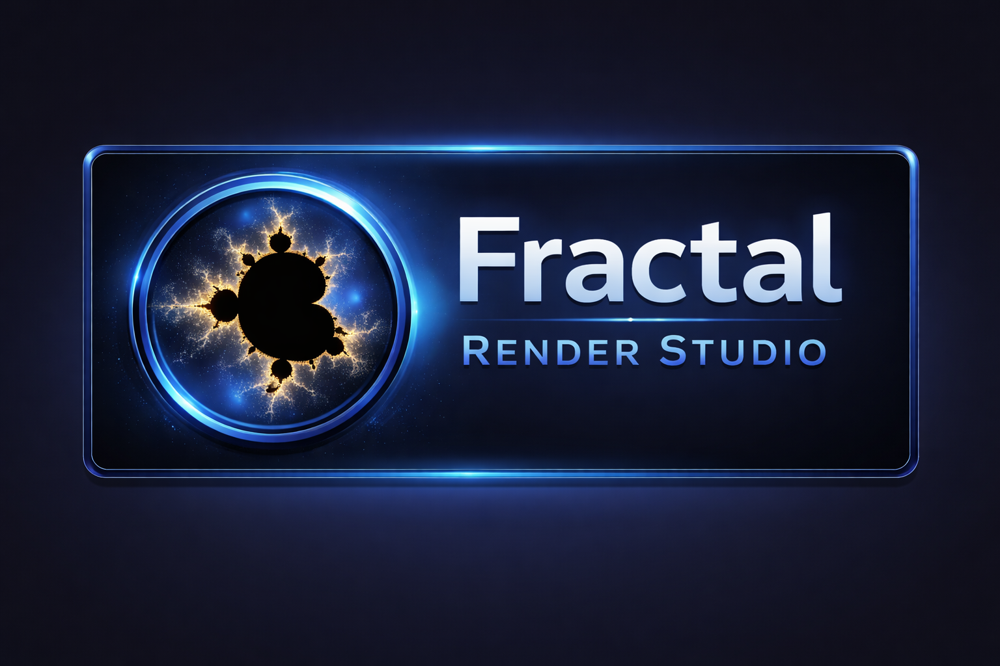
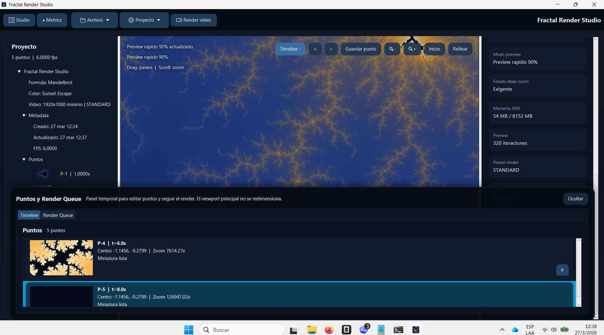
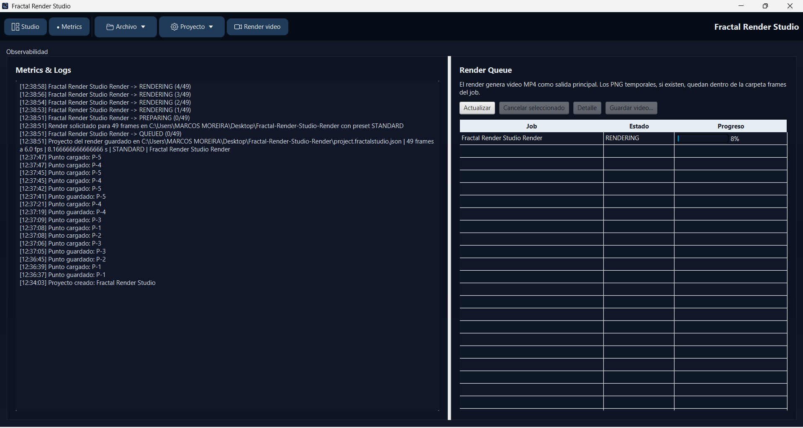

# Fractal Render Studio

Explora fractales, guarda recorridos profundos y conviertelos en video MP4 desde una aplicacion de escritorio pensada para trabajo visual real, no para pruebas de laboratorio.

Fractal Render Studio esta orientado a una experiencia directa:
- exploras el fractal en tiempo real
- guardas puntos matematicos del recorrido
- interpolas automaticamente los estados intermedios
- renderizas video en una carpeta de trabajo autocontenida

## Que hace

- exploracion interactiva con paneo y zoom profundo
- puntos de camara con miniaturas
- timeline visual basado en puntos
- inspector editable de formula, paleta e iteraciones
- render de video MP4 como salida principal
- carpeta de render con `render.mp4`, `frames/` y `project.fractalstudio.json`
- proyecto reabrible desde el JSON generado
- modo de sesion efimero: al cerrar, no arrastra trabajo anterior interno

## Capturas

### Vista principal


### Timeline y puntos



### Metricas y cola de render



## Flujo de trabajo

1. Abre un proyecto limpio.
2. Explora el fractal con scroll y paneo.
3. Guarda puntos del recorrido.
4. Define duracion y FPS del video.
5. Elige una carpeta base y el nombre del render.
6. El sistema crea una carpeta propia del render con todo lo necesario.
7. Reabre el proyecto mas tarde usando el `project.fractalstudio.json` guardado dentro de esa carpeta.

## Formulas disponibles

- Mandelbrot
- Burning Ship
- Tricorn
- Celtic Mandelbrot

## Salida del render

Cada render crea una carpeta de trabajo dentro del directorio que elijas. Ahi encontraras:

- `render.mp4`
- `frames/` si hubo frames temporales
- `project.fractalstudio.json`

Ese JSON contiene el proyecto completo para volver a abrirlo en la aplicacion.

## Punto de entrada

La aplicacion arranca desde:

- [FractalStudioApplication.java](src/main/java/com/marcos/fractalstudio/presentation/app/FractalStudioApplication.java)

## Ejecutar en desarrollo

Requisitos:

- JDK 21
- Maven Wrapper incluido

Windows:

```powershell
.\mvnw.cmd javafx:run
```

## Verificacion

```powershell
.\mvnw.cmd -q compile
.\mvnw.cmd -q test
```

## Generar instalador de Windows

El proyecto incluye script de empaquetado para generar un instalador real de Windows. La salida recomendada para distribucion es `MSI`, y ademas puedes obtener un `app-image` portable para validacion local.

```powershell
.\scripts\package-windows.ps1 -Type msi
```

Salida esperada:

- `target/installer/FractalRenderStudio-0.1.0.msi`

Tambien puedes elegir el tipo manualmente:

```powershell
.\scripts\package-windows.ps1 -Type exe
.\scripts\package-windows.ps1 -Type msi
.\scripts\package-windows.ps1 -Type app-image
```

## Arquitectura

```text
src/main/java/com/marcos/fractalstudio
|-- presentation
|-- application
|-- domain
`-- infrastructure
```

Documentacion complementaria:

- [Mapa documental](docs/documentation-map.md)
- [Arquitectura implementada](docs/implementation-architecture.md)
- [Ingenieria de software y patrones](docs/software-engineering-and-design-patterns.md)
- [Estructuras de datos, algoritmos y complejidad](docs/data-structures-algorithms-and-complexity.md)
- [Teoria de la computacion y ciencia del fractal](docs/computation-theory-and-fractal-science.md)
- [Precision numerica y modelo de render](docs/numerical-precision-and-rendering-model.md)
- [Arbol del proyecto](docs/project-tree.md)
- [Checklist de release](docs/release-checklist.md)

## Estado del producto

Esta version ya esta pensada como entrega usable:

- UX de escritorio para exploracion fractal
- render final orientado a video
- proyectos guardables y reabribles
- empaquetado para distribucion en Windows
